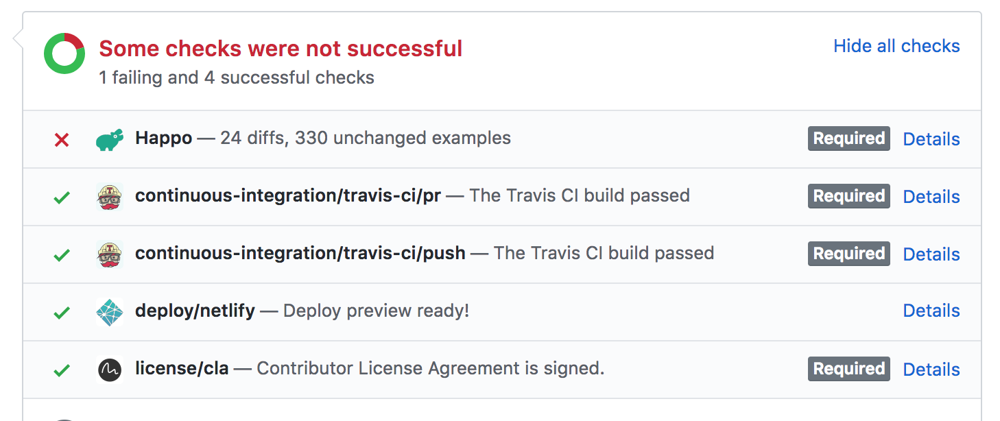
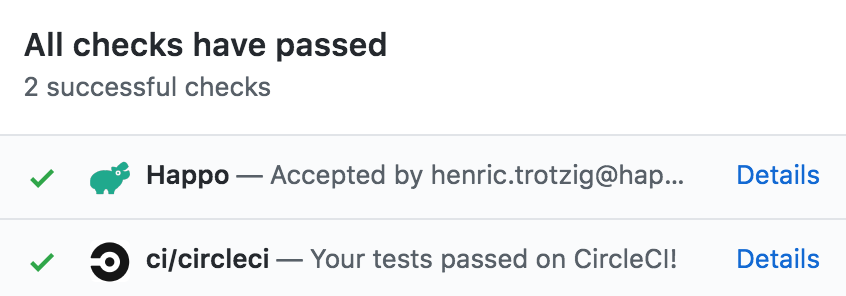

# Happo.io 

Happo is a visual regression testing tool. It hooks into your CI environment to
compare the visual appearance of UI components before and after a change.
Screenshots are taken in different browsers and across different screen sizes
to ensure consistent cross-browser and responsive styling of your application.

## Installation

```
npm install --save-dev happo.io
```

Happo depends on `webpack`, `babel-core` and `babel-loader` as well. If you
don't already have them installed, you need to add them.

```
npm install --save-dev webpack babel-core babel-loader
```

## Getting started

Before you can run happo, you need to define one or more component example
files. If you already have an existing source of component examples (e.g. an
existing [storybook](https://storybook.js.org/) integration, a
style-guide/component gallery), you can either use a [plugin](#plugins) or
follow the instructions in the [Generated examples](#generated-examples)
section. If not, continue reading!

We'll use React here, which is the default `type` that this client library
supports. Let's assume there's a `<Button>` component that we're adding
examples for. First, create a file called `Button-happo.jsx` and save it next
to your `Button.jsx` file (if this doesn't match your naming scheme you can use
the [`include`](#include) option). Add a few exports to this file (yes, you can
use ES6 here):

```jsx
import React from 'react';
import Button from './Button';

export const primary = () => <Button type="primary">Primary</Button>;
export const secondary = () => <Button type="secondary">Secondary</Button>;
```

Then, we need to add some configuration. API tokens are used to authenticate
you with the remote happo.io service: `apiKey` and `apiSecret`.  These can be
found on your account page at https://happo.io/account. You also need to tell
happo what browsers you want to target. In this example, we're using two
Chrome targets. One at 1024 x 768 screen ("desktop") and one on a 320 x 640
screen ("mobile").

```js
// .happo.js
const { RemoteBrowserTarget } = require('happo.io');

module.exports = {
  // It's good practice to never store API tokens directly in the config file.
  // Here, we're using environment variables.
  apiKey: process.env.HAPPO_API_KEY,
  apiSecret: process.env.HAPPO_API_SECRET,

  targets: {
    'chrome-desktop': new RemoteBrowserTarget('chrome', {
      viewport: '1024x768',
    }),
    'chrome-mobile': new RemoteBrowserTarget('chrome', {
      viewport: '320x640',
    }),
  },
};
```

Save this file as `.happo.js`in the root folder of your project.

Once we're done with the configuration it's time to try things out. Before we
do that, let's add a `script` to our `package.json` file so that it's easier to
invoke commands:

```json
{
  "scripts": {
    "happo": "happo"
  }
}
```

This will expose a `happo` script we can run with

```bash
npm run happo run
```

Go ahead and run that command now.

If things are successful, you'll see something like this at the end of the run:

```
Uploading report for h5a4p3p2o1...
View results at https://happo.io/a/28/report/h5a4p3p2o1
Done h5a4p3p2o1
```

This first run will serve as our baseline. But now we need something to compare
that baseline with. A good way to test the whole flow is to make a change to a
component example and verify that happo will catch that difference. Open one of
your `*-happo.jsx` files and make some changes, e.g.

```jsx
export const primary = () => <Button type="primary">PRIMARY</Button>;
export const secondary = () => <Button type="secondary">Secondary</Button>;
export const tertiary = () => <Button type="tertiary">Tertiary</Button>;
```

Here, we made primary button have ALL CAPS and added a `tertiary` variant.

Let's run happo a second time:

```bash
npm run happo run
```

This time, we'll get a different hash:
```
Uploading report for h1a2p3p4o5...
View results at https://happo.io/a/28/report/h1a2p3p4o5
Done h1a2p3p4o5
```

Once the second run is done, we can compare the two runs by passing both hashes
to the `happo compare` action:

```bash
$ npm run --silent happo compare h5a4p3p2o1 h1a2p3p4o5
Differences were found.

- 2 diffs
- 2 added examples
- 2 unchanged examples

View full report at
https://happo.io/a/28/compare/h5a4p3p2o1/h1a2p3p4o5

→ exit status: 1
```

Don't worry about the command failing with a non-zero exit code. This is by
design, scripts use the exit code as a signal that there is a diff.

If you open this URL in a browser, you'll see something like this:


We've now covered the most important steps and commands involved in making a
full happo run. Normally, you won't run all these commands locally. Instead,
you'll configure your CI environment to do it for you, on every
PR/commit/branch pushed. Let's look at how you can do that next.

## Integrating with your Continuous Integration (CI) environment

Once you've gone through the Getting Started guide, you should have a good
understanding of what commands are involved in making a full, two-pass, Happo
run. Happo works by running twice. Once to create a baseline, and a second time
to compare against this baseline.

Since a lot of projects these days follow a pull-request model using Github,
Happo provides ready-made scripts that you can run in CI:

- `happo-ci-travis` - a script designed to be run in a Travis environment.
- `happo-ci-circleci` - a script designed to be run in a CircleCI environment.
- `happo-ci` - a generic script designed to work in any CI environment. This
  script is used by both `happo-ci-travis` and `happo-ci-circleci` under the
  hood.

These scripts will all:

1) Run happo on the commit which the PR is based on
2) Run happo on the current HEAD commit
3) Compare the two reports
4) If allowed to, post back a status to the PR (the HEAD commit)

These scripts will detect your npm client (yarn or npm) and run `npm
install`/`yarn install` before running happo on the commits. If you have other
dependencies/preprocessing steps that need to happen, you can override this
with the `INSTALL_CMD` environment variable. E.g.

```bash
INSTALL_CMD="lerna bootstrap" npm run happo-ci-travis
```

In this example, the `lerna bootstrap` command will be invoked before running
`happo run` on each commit, instead of `yarn install`/`npm install`.

### `happo-ci-travis`

This script knows about the Travis build environment, assuming a PR based
model. To run it, first add this to your `package.json`:

```json
{
  "scripts": {
    "happo": "happo",
    "happo-ci-travis": "happo-ci-travis"
  }
}
```

Then, configure `.travis.yml` to run this script:

```yaml
language: node_js
script:
- npm run happo-ci-travis
```

### `happo-ci-circleci`

This script knows about the CircleCI build environment, assuming a PR based
model. To run it, first add this to your `package.json`:

```json
{
  "scripts": {
    "happo": "happo",
    "happo-ci-circleci": "happo-ci-circleci"
  }
}
```

Then, configure `.circleci/config.yml` to run this script. Something like this:

```yaml
jobs:
  build:
    docker:
      - image: circleci/node:8
    steps:
      - checkout
      - run:
          name: happo
          command: npm run happo-ci-circleci
```

### `happo-ci`

This is a generic script that can run in most CI environments. Before using it,
you need to set a few environment variables:

- `PREVIOUS_SHA` - the sha of the baseline commit
- `CURRENT_SHA` - the sha of the current HEAD
- `CHANGE_URL` - a link back to the change

```json
{
  "scripts": {
    "happo": "happo",
    "happo-ci": "happo-ci"
  }
}
```

### Posting statuses back to PRs/commits

By installing the [Happo Github App](https://github.com/apps/happo) and
connecting to it on the [Github integration page on
happo.io](https://happo.io/github-integration), you allow Happo to update the
status of a PR/commit.



If there is a diff, the status will be set to failure. To manually flip this to a success status, just go to the Happo comparison page and click the Accept button at the top.


The status over on github.com will then change to green for the PR/commit.



Apart from having the [Happo Github App](https://github.com/apps/happo)
installed and connected on
[happo.io/github-integration](https://happo.io/github-integration), you also
need to make sure that you provide a `--link <url>` with your calls to `happo
compare`. If you're using any of the standard CI scripts listed above, the
`--link` is automatically taken care of for you.

## Defining examples

The default way of defining happo examples for a component is through a
`ComponentName-happo.jsx` file, with an ES export for each variant you are
looking to test:

```jsx
export const primary = () => <Button type="primary">Primary</Button>;
export const secondary = () => <Button type="secondary">Secondary</Button>;
```

You can use the default export as well:

```jsx
export default () => <Button>Submit</Button>;
```

If you are more comfortable with CommonJS syntax, you can export an object
instead:

```jsx
module.exports = {
  primary: () => <Button type="primary">Primary</Button>,
  secondary: () => <Button type="secondary">Secondary</Button>,
};
```

Happo will infer the component name from the file. In the example above, if the
file is named `Button-happo.jsx`, the inferred name will be `Button`.

### Generated examples

If you want to group multiple components in one file you can export an array
instead, with objects defining the component and its variants. This can be
handy if you for some reason want to auto-generate happo examples from another
source (e.g. a style-guide, a component gallery etc).

```jsx
export default [
  {
    component: 'Button',
    variants: {
      primary: () => <Button type="primary">Primary</Button>,
      secondary: () => <Button type="secondary">Secondary</Button>,
    },
  },
  {
    component: 'Icon',
    variants: {
      small: () => <Icon size="small" />,
      large: () => <Icon size="large" />,
    },
  },
]
```

### Asynchronous examples

If you have examples that won't look right on the initial render, you can
return a promise from the example function. Happo will then wait for the
promise to resolve before it uses the markup in the DOM. This is useful if you
for instance have components that have some internal state that's hard to reach
without interacting with the component. To simplify rendering to the DOM, Happo
provides you with a function as the first argument to the example function.
When `type` is `react`, this function is a wrapper around `ReactDOM.render`.
When `type` is `plain`, this function is a simple `element.innerHTML` call,
returning a root element where that html got injected.

```jsx
// React example
export const asyncComponent = (renderInDom) => {
  return new Promise((resolve) => {
    const component = renderInDom(<Foo />);
    component.doSomethingAsync(resolve);
  });
};
```

```js
// Plain js example
export const asyncComponent = (renderInDom) => {
  const rootElement = renderInDOM('<div>Loading...</div>');
  return doSomethingAsync().then(() => {
    rootElement.querySelector('div').innerHTML = 'Done!';
  });
};
```

You can use `async`/`await` here as well:

```jsx
export const asyncComponent = async (renderInDom) => {
  const component = renderInDom(<Foo />);
  await component.doSomethingAsync();
  component.doSomethingSync();
};
```

Be careful about overusing async rendering as it has a tendency to lead to a
more complicated setup. In many cases it's better to factor out a "view
component" which you render synchronously in the Happo test.

## Plugins

### Storybook

The Happo plugin for [Storybook](https://storybook.js.org/) will automatically
turn your stories into Happo examples.

```bash
npm install --save-dev happo-plugin-storybook
```

```js
const happoPluginStorybook = require('happo-plugin-storybook');

// .happo.js
module.exports {
  // ...
  plugins: [
    happoPluginStorybook(),
  ],
};
```

## Local development

The `happo dev` command is designed to help local development of components. In
dev mode, happo will watch the file system for changes, and regenerate
screenshots on every change. Used in combination with the `--only` option, this
is a great tool for iterating on a component. Let's see how it works:

```bash
⨠ yarn happo dev --only Button
Initializing...
Generating screenshots...
Waiting for firefox results (ID=254)...
Waiting for chrome results (ID=255)...
Waiting for internet explorer results (ID=256)...
Preparing report (dev-ff4c58da118671bd8826)...
View results at https://happo.io/report?q=dev-ff4c58da118671bd8826
```

If you then make changes to the code that renders Button, happo will kick off
another run. If there are diffs from the previous run, you'll see those in
the console:

```bash
Initializing...
Generating screenshots...
Waiting for firefox results (ID=254)...
Waiting for chrome results (ID=255)...
Waiting for internet explorer results (ID=256)...
Preparing report (dev-ff4c58da118671bd8826)...
View results at https://happo.io/report?q=dev-ff4c58da118671bd8826

Generating screenshots...
Waiting for firefox results (ID=258)...
Waiting for chrome results (ID=259)...
Waiting for internet explorer results (ID=260)...
Preparing report (dev-87ae2e31d6014fe4bd65)...
View results at https://happo.io/report?q=dev-87ae2e31d6014fe4bd65

Comparing with previous run...

  Differences were found.

  - 2 diffs
  - 2 unchanged examples

  View full report at
  https://happo.io/compare?q=dev-ff4c58da118671bd8826..dev-87ae2e31d6014fe4bd65
```

*NOTE*: The `--only` flag will match against the file name exporting the happo
examples by default. So `--only Button` will match against e.g.
`src/components/Button/happo.jsx`, `src/components/Button-happo.js`. If you are
exporting a lot of happo examples from a single file you can use the `#`
delimiter to signal that you want to filter inside the list of exports. This is
especially useful when you are dynamically generating happo examples in a
single file. Here's an example:

```bash
⨠ yarn happo dev --only AllComponents#Button
```

In this case, only the "Button" component in the file named e.g.
`**/AllComponents/happo.js` will be included in the report.

## Image loading

Examples can reference images in a few different ways:

- Through external URLs, e.g. ``. Happo
  will wait for these to be downloaded before the screenshot is taken.
- With internal paths, combined with `publicFolders` configuration. E.g.
  ``. Make sure to add an (absolute) path
  to the folder containing your assets in the `publicFolders` config option.
  Happo will automatically inline these as base64 URLs.
- With images inlined as base64 URLs. This is often automated using webpack
  config, so that for you can `import fooImage from './images/foo.png'`
  directly.

## CSS Loading Strategies

Happo works best when CSS code is co-located with the components. In some
cases, you'll get away with zero configuration to get this working. But in many
cases, you'll have to add a little webpack config to the mix. Happo uses
webpack under the hood when generating browser-executable javascript. The
`customizeWebpackConfig` config option will let you inject things like webpack
loaders to the happo run. E.g.

```js
module.exports = {
  customizeWebpackConfig: (config) => {
    config.module.rules.push({
      test: /\.css$/,
      use: [{ loader: cssLoader }],
    });
   // it's important that we return the modified config
    return config;
  },
}
```

## Configuration

Happo will look for configuration in a `.happo.js` file in the current working
folder. You can override the path to this file through the `--config` CLI
option. This file isn't subject to babel transpilation, so it's best to stay
with good old CommonJS syntax unless you're on the very latest Node version.

### `include`

Controls what files happo will grab examples from. The default is
`'**/@(*-happo|happo).@(js|jsx)'`. This option is useful if you want to apply a
different naming scheme, e.g. `**/*-examples.js`.

### `stylesheets`

If you rely on external stylesheets, list their URLs or (absolute) file paths
in this config option, e.g. `['/path/to/file.css', 'http://cdn/style.css']`.

### `type`

Either `react` (default) or `plain`. Decides what strategy happo will use when
rendering examples. When the value is `react`, it is assumed that example
functions return a React component (e.g. `export default () => <Foo />`). When
the value is `plain`, it is assumed that example functions write things
straight to `document`, e.g.
`export default () => { document.body.appendChild(foo()) }`.

### `targets`

This is where you specify the browsers you want to be part of your happo run. E.g.

```js
module.exports = {
  targets: {
    // The first part ('firefox-desktop' in this case) is just a name we give
    // the specific browser target. You'll see this name in the reports generated
    // as part of a happo run.
    'firefox-desktop': new RemoteBrowserTarget('firefox', {
      viewport: '1024x768',
    }),
    'firefox-mobile': new RemoteBrowserTarget('firefox', {
      viewport: '320x640',
    }),
    'chrome': new RemoteBrowserTarget('chrome', {
      viewport: '800x600',
    }),
    'internet explorer': new RemoteBrowserTarget('internet explorer', {
      viewport: '800x600',
    }),
  },
};
```

This is a list of all supported browsers:

- `firefox` (latest stable version)
- `chrome` (latest stable version)
- `internet explorer` (version 11)

### `customizeWebpackConfig`

A function you can use to override or modify the default webpack config used
internally by happo during a run. Make sure to always return the passed in
`config`. E.g.

```js
module.exports = {
  customizeWebpackConfig: (config) => {
    config.module.rules.push({
      test: /\.css$/,
      use: [{ loader: cssLoader }],
    });
   // it's important that we return the modified config
    return config;
  },
}
```

In many cases, directly depending on the `modules` object of an existing
webpack configuration is enough. For instance, this is what you would need to
get up and running with a project using
[create-react-app](https://github.com/facebook/create-react-app):

```js
module.exports = {
  customizeWebpackConfig: (config) => {
    config.module = require('react-scripts/config/webpack.config.dev').module;
    return config;
  },
}
```

### `plugins`

An array of happo plugins. Find available plugins in the [Plugins](#plugins)
section.

```js
const happoPluginStorybook = require('happo-plugin-storybook');

module.exports = {
  plugins: [
    happoPluginStorybook(),
  ],
}
```

### `publicFolders`

An array of (absolute) paths specifying the places where public assets are
located. Useful if you have examples that depend on publicly available images
(e.g. ``).

```js
const path = require('path');

module.exports = {
  publicFolders: [
    path.resolve(__dirname, 'src/public'),
  ],
}
```

### `setupScript`

A path to a file that will be executed before rendering your components. This
is useful if you for instance want to inject global css styling (e.g. a css
reset), custom fonts, polyfills etc. This script is executed in a DOM
environment, so it's safe to inject things into the `<head>`.

```js
const path = require('path');

module.exports = {
  setupScript: path.resolve(__dirname, 'happoSetup.js'),
}
```

### `getRootElement`

A function returning a DOM element that Happo will use as the container. In
most cases, you should leave this empty and let Happo figure out the root
element itself. But in some cases its useful to override the default behavior
and provide a different root. An example would be if you have wrapper
components that you don't want to be part of the screenshot.

```js
module.exports = {
  getRootElement(document) {
    return document.querySelector('.react-live-preview');
  },
}
```
(example from [mineral-ui](https://github.com/mineral-ui/mineral-ui/blob/e48a47d917477b58e496fe43edbfa4bb6ceb88e9/.happo.js#L35))

### `tmpdir`

Happo uses webpack internally. By default, bundles are created in the temp
folder provided by the operating system. You can override where bundles are
stored with the `tmpdir` configuration option.

```js
module.exports = {
  tmpdir: '/some/absolute/path/to/an/existing/folder',
}
```

## Command-Line-Interface (CLI)

While you are most likely getting most value from the ready-made CI integration
scripts, there are times when you want better control. In these cases, you can
use any combination of the following CLI commands to produce the results you
desire.

- `happo run [sha]` - generate screenshots and upload them to the remote
  happo.io service. Supports the `--link <url>` and `--message <message>`
  flags.
- `happo dev` - start dev mode, where you can make changes incrementally and
  view the results on happo.io as you go along.
- `happo has-report <sha>` - check if there is a report already uploaded for
  the sha. Will exit with a zero exit code if the report exists, 1 otherwise.
- `happo compare <sha1> <sha2>` - compare reports for two different shas. If
  a `--link <url>` is provided, Happo will try to post a status back to the
  commit (see [Posting statuses back to
  PRs/commits](#posting-statuses-back-to-prscommits) for more details)
  being installed). If an `--author <email>` is provided, any comment made on a diff
  will notify the author. Also supports `--message <message>`, which is used
  together with `--link <url>` to further contextualize the comparison.

## Frequently Asked Questions (FAQ)

This section aims to explain a few things that might come as surprises to
anyone using happo.io.

### Can happo render any component?

It can, but results may not always be what you want. For performance and
security reasons, happo renders all examples in a JSDOM environment. The HTML
and CSS is collected and sent to real browsers. Because of that, components
that depend on any of these strategies/technologies might not look exactly
right:

- Measuring dimensions (e.g. `getBoundingClientRect`)
- Async data

There might be ways to break these dependencies that make your component render
better in a happo.io environment. You can for instance inject dimensions and
data as props instead of relying on the component to compute it itself.

### Can I use external fonts

Yes, either through providing an external stylesheet in the `stylesheets`
config or by injecting them as inline base64 urls through a `happoSetup` file.

